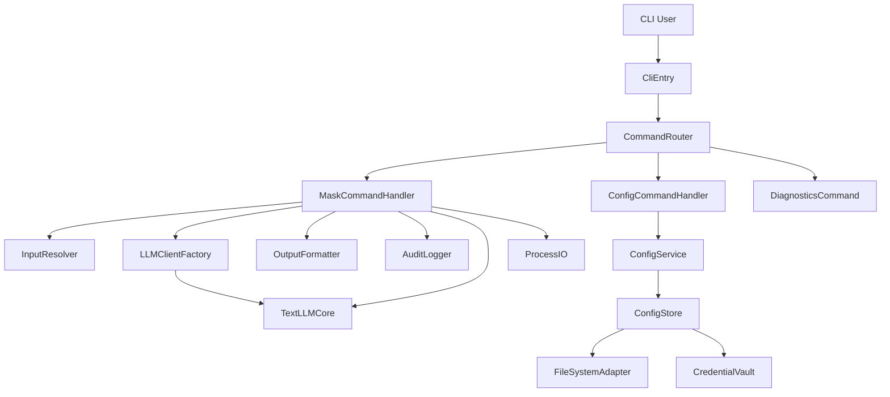
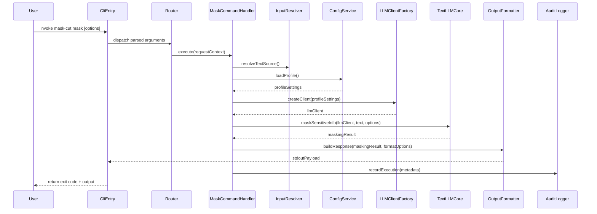
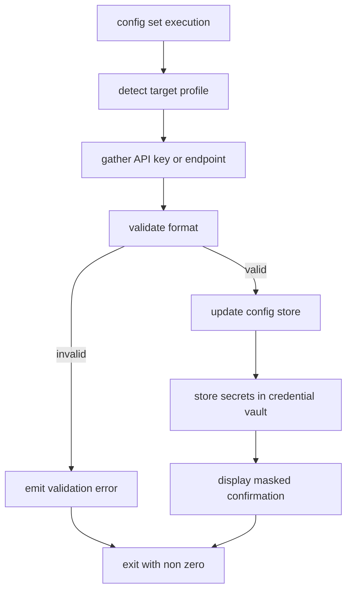

# Design Document

## Overview
Mask-Cut CLI は、テキストをコマンドラインから安全にマスキングし、LLM 連携前の匿名化ワークフローを自動化するためのインターフェースを提供する。開発者や運用担当者はコアライブラリ (@mask-cut/text-llm-core) を直接扱うことなく統一された操作体系でマスキング処理を実行できる。
本機能は CLI からコアライブラリと LLM 接続設定を管理し、ファイル・標準入力・対話モードなど複数入力パターンに対応することで自動化パイプラインとの連携や日常運用を支援する。

### Goals
- マスキング実行コマンド (`mask-cut mask`) を安定提供し、入力形式の違いを吸収する。
- LLM 接続設定を CLI から安全かつ再現性高く管理できるようにする。
- 出力形式・終了コード制御や監査用ログにより、自動化パイプラインでの信頼性を確保する。

### Non-Goals
- GUI やブラウザ拡張の操作フローは対象外とし、CLI 以外の UX 改善は扱わない。
- LLM マスキングアルゴリズム自体の改良は行わず、`@mask-cut/text-llm-core` の API を前提とする。
- 設定ストアのリモート同期や複数ユーザー共有機能は将来検討とし、今回はローカル端末内の管理に限定する。

## Architecture

### Existing Architecture Analysis
- CLI は現在 `apps/cli/src/index.ts` に単一ファイルで実装されており、エントリーポイント兼ロジックが密結合である。設定管理や複数コマンド構成は未整備。
- コアロジックは `@mask-cut/text-llm-core` に集約され、`maskSensitiveInfo` と `OpenAICompatibleClient` を公開している。CLI 側はこれらを利用してマスキングを実行する必要がある。
- モノレポは pnpm で管理され、ビルドは tsup、実行は tsx など既存ツールチェーンが整備済み。CLI もこの構成に合わせたビルド成果物 (ESM + shebang) が期待される。

### High-Level Architecture



**Architecture Integration**
- 既存パターン: コアロジックは `packages/` に集約し、CLI は薄いシェルであることを維持する。
- 新規コンポーネント: 設定管理 (`ConfigService`/`ConfigStore`)、コマンドルータ、監査ロガーを追加し、責務を分割する。
- 技術整合: Node.js ランタイム + TypeScript/tsup ビルドという既存スタックを踏襲する。
- ステアリング準拠: 単一責務・型安全・明確な依存方向 (CLI → コアライブラリ) を守る。

### Technology Stack and Design Decisions

#### CLI レイヤー
- **選定**: Node.js 18+ + TypeScript (ESM) + tsup バンドル。
- **理由**: 既存モノレポの標準構成であり、`#!/usr/bin/env node` バナー付与が tsup で統一可能。
- **代替案**: esbuild などの他バンドラはあるが、マルチフォーマット出力要件がないため既存タスクを再利用する。

#### 設定管理
- **選定**: ユーザーごとの設定ディレクトリ (XDG / APPDATA / HOME) に JSON 保存し、API キーなど機微情報は OS キーチェーン (`keytar`) で保護する二層構成。
- **理由**: テキスト設定と認証情報の境界を分け、ファイル権限/環境依存リスクを軽減する。CLI からの参照も非同期 API で統一可能。
- **代替案**: 単一 JSON ファイルへの平文保存は実装が容易だが、セキュリティリスクが高いため採用しない。

#### ロギング／監査
- **選定**: 構造化ログ (JSON Lines) を任意ファイルへ追記する軽量実装。
- **理由**: 要件で定義された開始・終了時刻、処理件数を機械可読に残すことで後続分析が容易になる。
- **代替案**: syslog 連携は設定が重いため初期リリースでは保留。

### Key Design Decisions
- **Decision**: コマンドルータ + ハンドラ構成を採用する。  
  **Context**: CLI には `mask`, `config set`, `config show`, 将来的な `diagnostics` など複数コマンドが存在し、単一ファイル実装では保守が困難。  
  **Alternatives**: (1) 既存の手続き的実装を継続、(2) `commander` など外部 CLI フレームワークを利用。  
  **Selected Approach**: 独自の軽量ルータとハンドラインターフェースを定義し、将来的なフレームワーク移行にも対応できる柔軟性を確保。  
  **Rationale**: 依存追加を避けつつ責務分離でき、単体テスト実施も容易。  
  **Trade-offs**: CLI 引数パースの一部を自前で維持するコストが残る。

- **Decision**: 設定ストアは JSON 設定 + `keytar` ベースの資格情報ボルトで設計する。  
  **Context**: 要件 2 では API キー等を「安全に保存」することが求められる。  
  **Alternatives**: (1) `.env` ファイル、(2) 環境変数のみに依存、(3) データベース利用。  
  **Selected Approach**: 機微情報は OS キーチェーンに格納し、その他設定は JSON ファイルで管理。  
  **Rationale**: クロスプラットフォームで利用可能、平文保存より安全、外部サービス不要。  
  **Trade-offs**: `keytar` インストールが必要となり、ビルド時にネイティブ依存解決が発生する可能性がある。

- **Decision**: 出力フォーマットは構造化レスポンスパイプラインで制御する。  
  **Context**: 要件 3 で JSON 出力・静粛モード・ドライランが求められている。  
  **Alternatives**: (1) 各ハンドラで出力処理を個別実装、(2) 共通ヘルパー関数を共有。  
  **Selected Approach**: `OutputFormatter` と `ProcessIO` を分離し、ハンドラは純粋な結果オブジェクトを返す。  
  **Rationale**: テスト容易性と一貫したフォーマット制御を実現できる。  
  **Trade-offs**: 追加の層により初期実装が増える。

## System Flows





## Requirements Traceability

| Requirement | Summary | Components | Interfaces | Flows |
|-------------|---------|------------|------------|-------|
| 1 (マスキング実行フロー) | 標準入力・ファイル・スタイル変更・JSON 出力に対応したマスキング | `MaskCommandHandler`, `InputResolver`, `OutputFormatter`, `AuditLogger` | `MaskCommand.execute`, `OutputFormatter.format`, `AuditLogger.record` | マスキングシーケンス |
| 2 (接続設定と認証管理) | API キー・エンドポイント等の設定登録と表示 | `ConfigCommandHandler`, `ConfigService`, `ConfigStore`, `CredentialVault` | `ConfigService.setCredentials`, `ConfigService.getProfile` | 設定フロー |
| 3 (出力制御と終了コード) | 終了コード、静粛モード、ドライラン | `ProcessIO`, `OutputFormatter`, `CliEntry` | `ProcessIO.emit`, `OutputFormatter.build`, `CliEntry.exit` | マスキングシーケンス |
| 4 (エラー処理と監査性) | タイムアウト・ネットワーク・ログファイル | `ErrorDomainMapper`, `AuditLogger`, `ConfigService` | `ErrorDomainMapper.toCliError`, `AuditLogger.recordFailure` | 設定フロー & マスキングシーケンス |

## Components and Interfaces

### CLI レイヤー

#### CliEntry
**Responsibility & Boundaries**
- Primary Responsibility: CLI プロセスの初期化、引数解析、ルータへの委譲、終了コード管理。
- Domain Boundary: アプリケーションシェル。
- Data Ownership: 実行時設定 (quiet, dry-run, log file) の一時管理。
- Transaction Boundary: 単一 CLI 実行単位。

**Dependencies**
- Inbound: プロセスエントリのみ。
- Outbound: `CommandRouter`, `ProcessIO`, `ErrorDomainMapper`.
- External: Node.js `process`, `console`.

**Contract Definition**
```typescript
interface CliApplication {
  run(argv: string[]): Promise<number>;
}
```
- Preconditions: エントリ時に Node.js 環境が整っていること。
- Postconditions: 終了コードを返し、副作用 (出力・ログ) を完了する。
- Invariants: 単一実行中にルータは一度だけ呼び出す。

#### CommandRouter
**Responsibility & Boundaries**
- Primary Responsibility: サブコマンドとオプションを解析し、適切なハンドラを呼び出す。
- Domain Boundary: CLI コマンド分岐。
- Data Ownership: 登録済みコマンドメタデータ。
- Transaction Boundary: 1 コマンド実行。

**Dependencies**
- Inbound: `CliEntry`.
- Outbound: 各 CommandHandler。
- External: なし。

**Contract Definition**
```typescript
interface CommandRouter {
  register(command: CommandDescriptor, handler: CommandHandler): void;
  dispatch(parsed: ParsedCommand): Promise<CommandResult>;
}
```
- Preconditions: コマンド名が登録済みであること。
- Postconditions: 対応ハンドラが実行され、結果が返る。

### コマンドハンドラ

#### MaskCommandHandler
**Responsibility & Boundaries**
- Primary Responsibility: マスキング要求の検証、入力取得、LLM 呼び出し、結果構築。
- Domain Boundary: マスキングユースケース Orchestrator。
- Data Ownership: なし (外部サービス結果を束ねる)。
- Transaction Boundary: 単一マスキング実行。

**Dependencies**
- Inbound: `CommandRouter`.
- Outbound: `InputResolver`, `ConfigService`, `LLMClientFactory`, `AuditLogger`, `OutputFormatter`.
- External: なし (外部アクセスは `LLMClientFactory` 経由)。

**Contract Definition**
```typescript
interface MaskCommandInput {
  textSource: TextSource;
  options: {
    style: MaskingStyle;
    keepLength: boolean;
    language: 'ja' | 'en' | 'auto';
    maskUnknown: boolean;
    format: 'text' | 'json';
    dryRun: boolean;
    profile: string;
  };
  logFile?: string;
}

interface MaskCommandHandler {
  execute(input: MaskCommandInput): Promise<MaskCommandOutput>;
}

interface MaskCommandOutput {
  maskedText?: string;
  diagnostic?: DiagnosticPayload;
  exitCode: number;
  telemetry: ExecutionTelemetry;
}
```
- Preconditions: `textSource` が少なくとも一つのソースを解決可能であること。
- Postconditions: 出力フォーマットに応じた結果が得られ、監査が記録される。
- Invariants: マスキングリクエストは非同期で一度のみ送信。

#### ConfigCommandHandler
**Responsibility & Boundaries**
- Primary Responsibility: プロファイルごとの API キー・エンドポイント・モデル設定を登録・表示する。
- Domain Boundary: 接続設定管理。
- Data Ownership: なし (保存は `ConfigService`)。
- Transaction Boundary: 設定更新単位。

**Dependencies**
- Inbound: `CommandRouter`.
- Outbound: `ConfigService`, `OutputFormatter`.
- External: なし。

**Contract Definition**
```typescript
interface ConfigCommandHandler {
  execute(input: ConfigCommandInput): Promise<CommandResult>;
}
```
- Preconditions: コマンド種類 (`set`, `show`, `list`) がサポートされている。
- Postconditions: 設定が永続化され、表示時は機密情報がマスクされる。

#### DiagnosticsCommand
**Responsibility & Boundaries**
- Primary Responsibility: ネットワーク疎通や依存チェックを実施し、対話モードの進行状況表示を支援する。
- Domain Boundary: 運用診断。
- Data Ownership: なし。
- Transaction Boundary: 単一診断実行。

**Dependencies**
- Inbound: `CommandRouter`.
- Outbound: `ConfigService`, `LLMClientFactory`, `OutputFormatter`.

### サポートサービス

#### InputResolver
**Responsibility & Boundaries**
- Primary Responsibility: `--text`, `--file`, 標準入力、対話モードからの入力を統一取得する。
- Domain Boundary: 入力取得ユーティリティ。
- Data Ownership: なし。
- Transaction Boundary: 1 入力取得。

**Dependencies**
- Inbound: `MaskCommandHandler`.
- Outbound: Node.js `fs`, `process.stdin`.

**Contract Definition**
```typescript
type TextSource =
  | { kind: 'inline'; value: string }
  | { kind: 'file'; path: string }
  | { kind: 'stdin' }
  | { kind: 'interactive' };

interface InputResolver {
  resolve(source: TextSource): Promise<{ text: string; metadata: InputMetadata }>;
}
```

#### ConfigService
**Responsibility & Boundaries**
- Primary Responsibility: プロファイルの取得・検証・更新を一元管理する。
- Domain Boundary: 設定ドメイン。
- Data Ownership: プロファイル定義。
- Transaction Boundary: 設定操作。

**Dependencies**
- Inbound: `MaskCommandHandler`, `ConfigCommandHandler`, `DiagnosticsCommand`.
- Outbound: `ConfigStore`, `CredentialVault`.

**Contract Definition**
```typescript
interface ConfigService {
  getProfile(name: string): Promise<ResolvedProfile>;
  setCredentials(input: CredentialInput): Promise<void>;
  listProfiles(): Promise<ProfileSummary[]>;
}
```
- Preconditions: プロファイル名はスラグ化済み。
- Postconditions: 保存時はバリデーションを通過し、必要項目が揃う。

#### ConfigStore
**Responsibility & Boundaries**
- Primary Responsibility: JSON 設定ファイルの読み書き、バージョン管理、ファイル権限の調整。
- Domain Boundary: 永続層アダプタ。
- Data Ownership: `CliConfig`.
- Transaction Boundary: ファイル単位。

**Dependencies**
- Inbound: `ConfigService`.
- Outbound: `FileSystemAdapter`.
- External: OS ファイルシステム。

**Contract Definition**
```typescript
interface ConfigStore {
  load(): Promise<CliConfig>;
  save(config: CliConfig): Promise<void>;
  ensureInitialized(): Promise<void>;
}
```
- State Management: 設定ファイルとメタデータ (schemaVersion, updatedAt) を保持。
- Integration Strategy: 現行 `src/index.ts` から設定処理を抽出し、配置換えする。

#### CredentialVault
**Responsibility & Boundaries**
- Primary Responsibility: API キー等の機微情報を暗号化ストアに保存・取得する。
- Domain Boundary: セキュリティ。
- Data Ownership: API キー、秘密。
- Transaction Boundary: 個別シークレット単位。

**Dependencies**
- Inbound: `ConfigService`.
- Outbound: `keytar` API。

**Contract Definition**
```typescript
interface CredentialVault {
  storeSecret(key: VaultKey, value: string): Promise<void>;
  getSecret(key: VaultKey): Promise<string | undefined>;
  deleteSecret(key: VaultKey): Promise<void>;
}
```
- Preconditions: OS キーチェーンが利用可能。
- Postconditions: 保存成功時に設定ファイルにはハッシュのみ残す。
- Risks: サーバーレス環境などキーチェーン非対応の場合はフォールバック (暗号化ファイル) を検討。

#### LLMClientFactory
**Responsibility & Boundaries**
- Primary Responsibility: プロファイル設定をもとに `LLMClient` を構築する。
- Domain Boundary: インフラ層。
- Data Ownership: デフォルトモデル設定。
- Transaction Boundary: クライアント生成。

**Dependencies**
- Inbound: `MaskCommandHandler`, `DiagnosticsCommand`.
- Outbound: `@mask-cut/text-llm-core` (`OpenAICompatibleClient`), `fetch`.

**Contract Definition**
```typescript
interface LLMClientFactory {
  create(config: ResolvedProfile): LLMClient;
}
```

#### OutputFormatter
**Responsibility & Boundaries**
- Primary Responsibility: マスキング結果・設定表示をテキストまたは JSON に整形する。
- Domain Boundary: プレゼンテーション。
- Data Ownership: なし。
- Transaction Boundary: 出力単位。

**Dependencies**
- Inbound: `MaskCommandHandler`, `ConfigCommandHandler`, `CliEntry`.
- Outbound: `ProcessIO`.

**Contract Definition**
```typescript
interface OutputFormatter {
  format(result: CommandResult, options: OutputOptions): FormattedPayload;
}
```

#### ProcessIO
**Responsibility & Boundaries**
- Primary Responsibility: stdout/stderr への出力と終了コード設定。
- Domain Boundary: IO アダプタ。
- Data Ownership: なし。
- Transaction Boundary: CLI 実行。

#### AuditLogger
**Responsibility & Boundaries**
- Primary Responsibility: 実行メタデータ (開始/終了時刻、件数、エラー) を構造化ログとして記録する。
- Domain Boundary: 監査ログ。
- Data Ownership: ログファイル。
- Transaction Boundary: 実行単位。

**Contract Definition**
```typescript
interface AuditLogger {
  record(entry: ExecutionTelemetry): Promise<void>;
}
```

#### ErrorDomainMapper
**Responsibility & Boundaries**
- Primary Responsibility: 例外を CLI 向けエラーコードとメッセージに写像する。
- Domain Boundary: エラーハンドリング。
- Data Ownership: なし。
- Transaction Boundary: エラー発生時。

## Data Models

### Logical Data Model

| Entity | Description | Fields | Notes |
|--------|-------------|--------|-------|
| `CliConfig` | CLI 全体の設定 | `schemaVersion: number`, `defaultProfile: string`, `profiles: Record<string, ProfileConfig>`, `log: LogSettings` | JSON ファイル (`config.json`) に保存 |
| `ProfileConfig` | プロファイルごとの接続設定 | `endpoint: string`, `model: string`, `vaultKeyId: string`, `updatedAt: string` | API キーは `vaultKeyId` を通じて `CredentialVault` に保存 |
| `LogSettings` | ログ出力設定 | `defaultLogFile?: string`, `append: boolean` | 監査ログのファイルパス |
| `ExecutionTelemetry` | 監査情報 | `command: string`, `profile: string`, `startedAt: string`, `finishedAt: string`, `status: 'success' | 'failure'`, `inputBytes: number`, `maskedBytes?: number`, `errorCode?: string` | JSON Lines 形式で保存 |

### Data Contracts & Integration
- **Masking Request**: `MaskCommandHandler` -> `maskSensitiveInfo`  
  - Request: `{ model: string; prompt: string; systemPrompt: string }` (既存ライブラリ定義を利用)  
  - Response: `{ text: string; raw?: unknown }`
- **CLI Output JSON**:  
  ```json
  {
    "maskedText": "string",
    "profile": "string",
    "options": {
      "style": "block|asterisk|maskTag",
      "keepLength": true,
      "language": "ja|en|auto",
      "maskUnknown": true
    },
    "metrics": {
      "durationMs": number,
      "inputBytes": number,
      "maskedBytes": number
    }
  }
  ```

## Error Handling

### Error Strategy
- 入力検証段階でフォーマットやサポート外オプションを即座に検出し、CLI 終了コード 2 を返す。
- LLM 呼び出しタイムアウトやネットワーク障害は再試行せず、明示的なエラーコード (`E_TIMEOUT`, `E_NETWORK`) を付与。
- 設定ストアアクセス失敗時は操作を中断し、ディレクトリ権限確認を促す。

### Error Categories and Responses
- **User Errors (4xx)**: 不正オプション、未設定 API キー。エラー文に再設定手順を記載。
- **System Errors (5xx)**: LLM 応答不良、ネットワーク遮断。監査ログに詳細を記録し、再実行を推奨。
- **Business Logic Errors (422)**: マスキング結果が空などユースケース違反。入力データ確認を促す。

### Monitoring
- `AuditLogger` により全実行結果を JSON Lines として記録。
- 失敗時は `errorCode` と `message`, `stackTrace` (オプション) を保持。
- 将来的な集中監視を想定し、ログファイルローテーションは実装ガイドに追記。

## Testing Strategy

- **Unit Tests**
  - `MaskCommandHandler` の成功/失敗パス (LLM クライアントをモック)。
  - `ConfigService` のバリデーション、プロファイル切替、vault フォールバック。
  - `OutputFormatter` の text/json/dry-run/quiet モード変換。

- **Integration Tests**
  - 実ファイルシステムを利用した設定保存と再読込。
  - `mask-cut mask` のエンドツーエンド (LLM クライアントをテストダブルに差し替え)。
  - `config set` → `mask` のシナリオで API キー取得～マスキングまでを検証。

- **E2E/CLI Tests**
  - `pnpm --filter @mask-cut/cli start -- --help` の出力検証。
  - 標準入力パイプ (`echo | mask-cut mask`) と終了コード検証。
  - `--dry-run` + `--quiet` 組合せの挙動確認。

- **Performance/Load**
  - 大規模テキスト (数 MB) のマスキングでレイテンシを計測。
  - 連続 10 回実行時のログファイル成長とリソース消費を測定。

## Security Considerations
- API キーは OS キーチェーンで暗号化保存し、表示時は先頭数文字以外をマスクする。
- 設定ファイル作成時にパーミッション (`0600`) を適用し、共有ディレクトリでの利用を禁止するガイドを記載。
- 環境変数 `MASK_CUT_API_KEY` `MASK_CUT_ENDPOINT` 等を優先利用し、キーをファイルに書き出さなくても済むようにする。
- CLI ログには個人情報を含めず、マスク済みテキストのみ記録し、入力原文を保存しない。

## Performance & Scalability
- マルチプロファイル下での設定ロードはキャッシュし、ディスクアクセスを最小化する。
- JSON 出力フォーマットはストリーム書き込みを利用し、大量テキストでもメモリ使用量を抑える。
- 進行表示 (対話モード) はログレベル設定に従い、ハイレート更新を抑制する。

