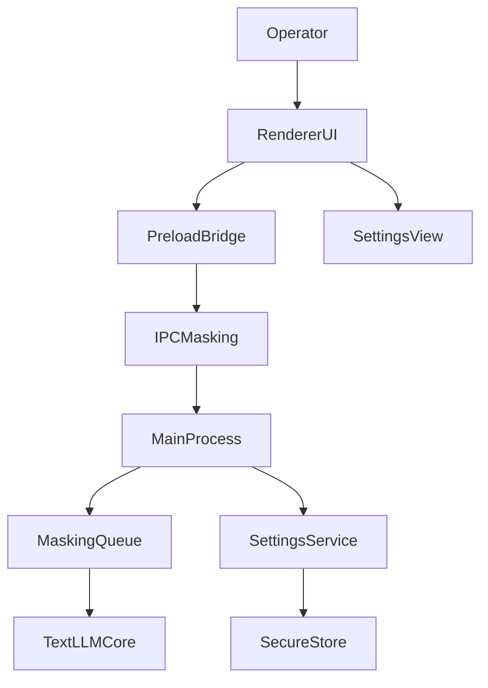
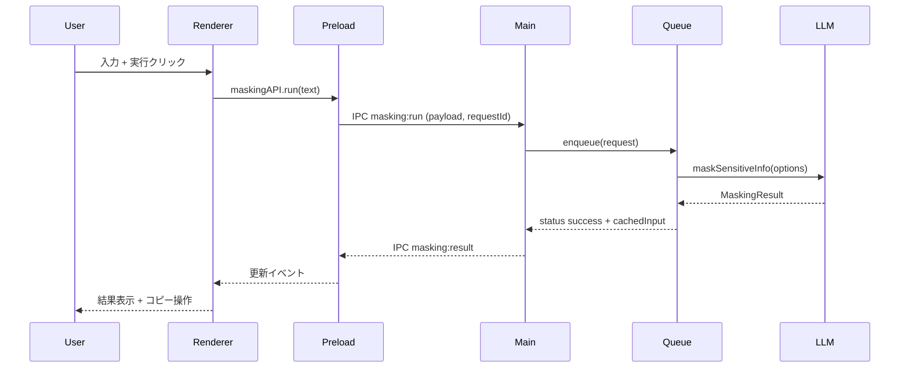
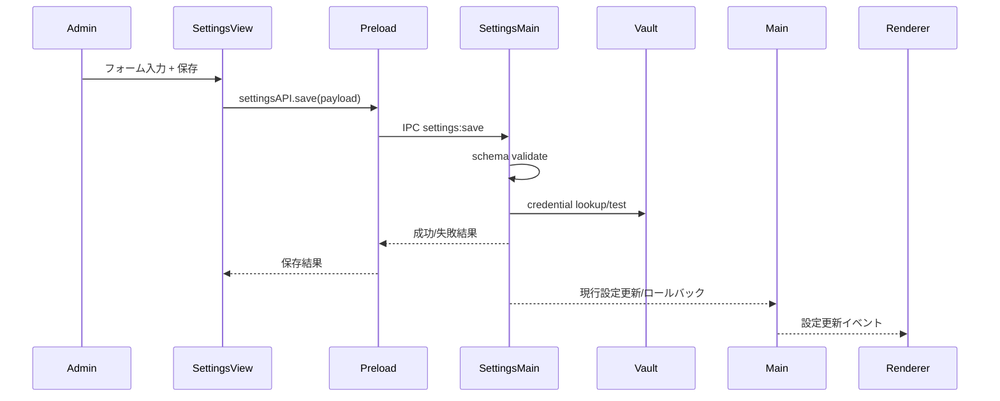
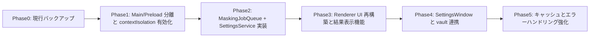

# Design Document

## Overview
Mask-Cut Electron クライアントは、LLM マスキングをデスクトップで完結できるフロントライン体験を提供する。メイン画面ではテキスト入力と結果確認を 1 画面に収め、反復的なマスキング作業を高速化する。設定画面は接続先エンドポイントとモデルを切り替える操作を集中させ、CLI や他クライアントと同じ抽象化を再利用する。

本機能はオペレーター (一次利用者) とワークスペース管理者 (設定変更者) の双方に価値をもたらす。オペレーターは入力・実行・結果確認を即時に繰り返せる。一方で管理者は API 接続情報とモデル選択を Electron 内で安全に適用できるため、クライアント間の設定差異を抑制できる。

### Goals
- メイン画面で空入力防止、並列送信制御、進行状況表示を備えたマスキング実行フローを実現する
- マスキング結果と失敗時メッセージを一貫した UI パターンで表示し、コピーや再送信を容易にする
- 設定画面でエンドポイント／モデル／API キー参照を編集・検証し、保存後にメイン画面へ即反映する

### Non-Goals
- LLM 推論やマスキングアルゴリズム自体の変更 (text-llm-core をそのまま利用)
- オフライン推論やローカル LLM の起動制御
- プロファイル同期やチーム共有など複数ユーザー設定の同期

## Architecture

### Existing Architecture Analysis
- 現行 Electron アプリは `BrowserWindow` 1 枚と単純な renderer スクリプトのみで構成され、`contextIsolation: false` のままワークスペースパッケージへ直接アクセスしている。
- 設定情報はハードコードされており、エンドポイントやモデルを切り替える仕組み、API キーの安全な格納、接続テストは存在しない。
- `maskSensitiveInfo` 実行結果は非同期処理だが、現在は並列送信制御や失敗時リトライの手当がない。

### 高レベルアーキテクチャ
Electron アプリをメインプロセス、preload、renderer の 3 層に分割し、設定管理とマスキング処理をメイン側へ集約する。renderer は contextBridge 経由 API のみを呼び出し、UI ロジックと状態表示に専念する。



**Architecture Integration**
- 既存パターン: text-llm-core をサービス層から呼び出す構造と、CLI と同じ credential vault メタデータを尊重。
- 新規コンポーネント: MaskingJobQueue, SettingsRepository, SettingsWindow を追加し、UI を main/settings の 2 ウィンドウに分離。
- 技術整合: Electron 28 + TypeScript + contextBridge を標準化し、`electron-store` + `keytar` をストレージ／秘密情報ストアに採用。
- Steering 準拠: 「コアライブラリ + 薄いクライアント」を守り、マスキングロジックは @mask-cut/text-llm-core へ委譲する。

### Technology Stack and Design Decisions

#### Technology Stack
- **Electron Main Process (TypeScript)**: BrowserWindow 管理、IPC ルーティング、MaskingJobQueue 実装を担当。既存 tsconfig を活用し CommonJS 出力を維持。
- **Preload (contextBridge)**: `maskingAPI` と `settingsAPI` を露出する薄いゲートウェイ。renderer から Node API を直接触れないよう隔離。
- **Renderer UI (Vanilla TS + Web Components / minimal state store)**: 小規模 UI のため React 等は導入せず、Litless な Web Components + `Observable` ヘルパーで状態同期。
- **Persistence**: `electron-store` で JSON 設定を保存し、API キーは `keytar` に vaultKeyId をキーとして退避。設定更新時に vault エントリ存在を検証。
- **LLM Access**: `@mask-cut/text-llm-core` の `OpenAICompatibleClient` を DI し、`maskSensitiveInfo` を利用。エンドポイント URL, model, key を SettingsService から注入。

#### Key Design Decisions
1. **Decision**: MaskingJobQueue をメインプロセスに集約し、renderer からの複数リクエストを逐次化する。
   - **Context**: 要件 1-4 で「前の処理が完了するまで待機」を保証する必要がある。
   - **Alternatives**: (a) renderer で Promise queue、(b) text-llm-core 側で内部ロック、(c) main プロセスでジョブ管理。
   - **Selected Approach**: (c) main プロセスに `MaskingJobQueue` クラスを置き、IPC 毎に requestId を付与して状態を配信。
   - **Rationale**: 1 箇所で接続設定とジョブ制御を扱えるため再送戦略やキャンセルも統一しやすい。
   - **Trade-offs**: main プロセスが単一障害点になるが、Electron では必須コンポーネントであり監視しやすい。

2. **Decision**: contextIsolation を true にし、preload で API を橋渡しする。
   - **Context**: 現状 renderer が Node API へ直接アクセスしセキュリティリスクがある。API キーや設定値を扱うため最小露出が必要。
   - **Alternatives**: (a) 現状維持, (b) sandbox モード, (c) contextBridge ベース。
   - **Selected Approach**: (c) preload スクリプトで `maskingAPI`, `settingsAPI`, `clipboardAPI` を公開。
   - **Rationale**: Electron 公式推奨で、renderer を DOM 操作だけに集中させられる。
   - **Trade-offs**: API 追加ごとに preload 更新が必要。

3. **Decision**: 設定保存前に接続テストを必須化し、失敗時ロールバックを行う。
   - **Context**: 要件 3-4 が成功時即時反映と失敗時ロールバック双方を求める。
   - **Alternatives**: (a) 保存のみ、エラー時ユーザー任せ (b) 非同期テストを renderer 側で実施 (c) 保存処理パイプラインでテスト→コミット。
   - **Selected Approach**: (c) SettingsService の `saveWithValidation` で schema validate → connectivity test → commit.
   - **Rationale**: 一貫した結果を保証し、renderer は結果通知を受け取るだけで済む。
   - **Trade-offs**: 保存体験がやや遅くなるが UI で進行表示を行い UX を担保する。

## System Flows

### マスキング実行フロー


### 設定更新フロー


## Requirements Traceability
| Requirement | Summary | 実装コンポーネント | インターフェース | フロー |
|-------------|---------|-------------------|------------------|-------|
| R1-1..5 | 入力検証・逐次実行・再送キャッシュ | Renderer MainView, Preload.maskingAPI, MaskingJobQueue, MaskingCache | `masking:run`, `masking:status` | マスキング実行フロー |
| R2-1..5 | 結果表示/コピー/エラーバナー/ショートリンク | ResultPanel, StatusBanner, ClipboardBridge, SettingsLink | `masking:result`, `clipboard:copy`, renderer routing | マスキング実行フロー |
| R3-1..5 | 設定編集・検証・反映・ロールバック | SettingsView, SettingsService, SecureStoreAdapter, VaultAdapter | `settings:get`, `settings:save`, `settings:test` | 設定更新フロー |

## Components and Interfaces

### Main Process Layer
- **AppBootstrap**: Electron lifecycle管理。`createMainWindow`, `createSettingsWindow`, `registerIpcHandlers` を呼び出す。
- **MainWindowController**: `BrowserWindow` (メイン) を生成。設定変更通知を renderer へ push。
- **SettingsWindowController**: 設定モーダル/別ウィンドウを生成し、`settings:open` イベントで表示。
- **MaskingJobQueue**:
  - 役割: リクエスト逐次化、状態遷移 (`queued|running|succeeded|failed`) を管理。
  - 主要 API:
    ```ts
    type MaskingJob = { id: string; text: string; enqueuedAt: number };
    class MaskingJobQueue {
      enqueue(job: MaskingJob, options: MaskingOptions): void;
      onStatus(listener: (event: MaskingStatusEvent) => void): void;
      cancel(jobId: string): void;
    }
    ```
- **MaskingService**:
  - `run(job: MaskingJob)` で SettingsService から接続情報を取得し `OpenAICompatibleClient` を生成。
  - 結果を `MaskingCache` へ保存して再送時に活用。
- **MaskingCache**: 直近入力/結果をディスクに保存 (アプリ再起動後も再送可能にする)。`electron-store` の `maskingCache` 名前空間を使用。
- **SettingsService**:
  - `get(): Promise<AppSettings>` / `saveWithValidation(dto: AppSettingsInput): Promise<AppSettings>`。
  - `validate(dto)` → `testConnectivity(dto)` → `commit(dto)` → `emitUpdate`。
  - `testConnectivity` では `OpenAICompatibleClient` に HEAD リクエスト (health) または最短プロンプト実行。
- **SettingsRepository**:
  - `load(): AppSettingsFile` / `write(payload: AppSettingsFile)` using `electron-store`。
  - 暗号情報は `vaultKeyId` のみ保存。
- **SecureStoreAdapter**:
  - `getSecret(vaultKeyId: string): Promise<string | null>`
  - `setSecret(vaultKeyId: string, value: string): Promise<void>` (必要に応じて)
  - 実装は `keytar`。
- **ClipboardBridge**: `clipboard.writeText` をラップし、renderer からの要求を実行。

### Preload Layer
- **maskingAPI**:
  ```ts
  interface MaskingAPI {
    run(request: MaskingRequestDto): Promise<void>;
    onStatus(listener: (event: MaskingStatusEvent) => void): void;
    retryLast(): Promise<void>;
  }
  ```
- **settingsAPI**:
  ```ts
  interface SettingsAPI {
    get(): Promise<AppSettingsViewModel>;
    save(payload: AppSettingsInput): Promise<SettingsSaveResult>;
    onUpdate(listener: (settings: AppSettingsViewModel) => void): void;
  }
  ```
- **clipboardAPI**: `copy(text: string): Promise<void>`。

### Renderer Layer
- **MainViewController**: 入力欄、送信ボタン、状態表示のステートマシンを管理。空入力時にはエラーメッセージを表示。
- **ResultPanel**: マスク済みテキスト、モデル名、エンドポイント識別子を表示。`CopyButton` と `RetryButton` を内包。
- **StatusBanner**: 成功/失敗/進行ステータスを色分けで表示し、設定画面へのショートリンクを含む。
- **SettingsView**: 別ウィンドウ内フォーム。`FormState` + `ValidationErrors` を保持し、保存進行を表示。
- **ViewState Store**: `BehaviorSubject<AppState>` で renderer 内部状態を一元管理し、`MainView`, `ResultPanel` が subscribe。

### IPC Contracts
| Channel | 方向 | Payload | 備考 |
|---------|------|---------|------|
| `masking:run` | renderer → main | `{ requestId, text }` | enqueue 要求。空文字は preload が弾く |
| `masking:status` | main → renderer | `{ requestId, state, message?, maskedText?, model?, endpoint? }` | 進捗/成功/失敗通知 |
| `masking:retry-last` | renderer → main | `void` | `MaskingCache` を再送 |
| `settings:get` | renderer → main | `void` | 現在設定を返す |
| `settings:save` | renderer → main | `{ endpointUrl, modelName, vaultKeyId }` | 保存 + テスト |
| `settings:update` | main → renderer | `AppSettingsViewModel` | メイン画面へのブロードキャスト |
| `clipboard:copy` | renderer → main | `{ text }` | Electron clipboard を利用 |

## Data Models

### Domain Model
- **MaskingJob**: `id`, `text`, `submittedAt`, `retryOf?`。逐次処理対象。
- **MaskingStatusEvent**: `jobId`, `state`, `progress`, `errorCode?`, `maskedText?`。
- **MaskingResultSnapshot**: `inputText`, `maskedText`, `modelUsed`, `endpointLabel`, `finishedAt`。
- **AppSettings**: `endpointUrl`, `modelName`, `vaultKeyId`, `timeoutMs`, `lastUpdatedAt`。

### Logical Data Model
| Entity | Fields | Type | Notes |
|--------|--------|------|-------|
| `appSettings` | endpointUrl | string | HTTPS 推奨、`URL` バリデーション |
| | modelName | string | text-llm-core へそのまま渡す |
| | vaultKeyId | string | keytar 参照キー |
| | timeoutMs | number | default 60_000 |
| | lastUpdatedAt | ISO string | UI 表示用 |
| `maskingCache` | lastInput | string | 再送用 |
| | lastResult | string | UI 再表示 |

### Data Contracts & Integration
```ts
type MaskingRequestDto = { requestId: string; text: string; options?: MaskingOptionsInput };
type MaskingStatusEvent = {
  requestId: string;
  state: 'queued' | 'running' | 'succeeded' | 'failed';
  message?: string;
  maskedText?: string;
  model?: string;
  endpoint?: string;
};

type AppSettingsInput = {
  endpointUrl: string;
  modelName: string;
  vaultKeyId: string;
  timeoutMs?: number;
};
```

## Error Handling
- **User Errors**: 空入力、無効 URL、必須フィールド欠如。renderer でフィールドエラーを表示し IPC を発行しない。`settingsAPI.save` は `validationErrors` を返す。
- **System Errors**: ネットワーク/LLM タイムアウト。`MaskingJobQueue` が `state: failed` + `errorCode` (`E_NETWORK`, `E_TIMEOUT`, `E_MASK_FAILED`) を renderer に送る。renderer はエラーバナーとリトライボタンを表示。
- **Business Logic Errors**: vaultKeyId に紐づく資格情報が存在しない等。SettingsService が `E_VAULT_MISSING` を返し、UI で credential 登録を促す。
- **Logging/Monitoring**: main プロセスで `electron-log` (追加) を使用し、マスキング実行と設定変更を JSON Lines で記録。後続で CLI プロファイルログと整合を取れる。

## Testing Strategy
- **Unit Tests**
  1. `MaskingJobQueue` が複数ジョブを FIFO で実行し、並列送信を防ぐ。
  2. `SettingsValidator` が URL/モデル/キー識別子の必須チェックを行う。
  3. `MaskingCache` が失敗時に最後の入力を保持する。
- **Integration Tests**
  1. IPC 経由で `masking:run` → `masking:status` が成功する happy path。
  2. `settings:save` が接続テスト失敗時にロールバックする。
  3. `settings:update` イベントを受けた renderer store が UI を更新する。
- **E2E/UI Tests** (Playwright + Spectron 代替)
  1. 空入力で送信した際、ボタンが無効化されエラーメッセージが表示される。
  2. 正常入力→結果表示→コピー操作が機能する。
  3. 設定画面でモデルを変更し保存後、メイン画面の表示が更新される。
- **Performance/Load**
  - 連続 10 リクエストの処理でキューが順序を保ち平均待ち時間 < 500ms (LLM 応答時間除く) を確認。

## Security Considerations
- `contextIsolation: true` と `sandbox: true` を設定し、preload で必要な API のみ公開。
- API キーは renderer へ露出させず `keytar` に保存し、settings 画面では `vaultKeyId` のみ扱う。
- エンドポイント URL は https 必須 (例外はローカル開発のみ) とし、証明書検証失敗時は保存を拒否。
- Clipboard 操作はユーザー操作時のみ許可し、自動コピーを禁止。

## Migration Strategy
既存シングルページ構成から新アーキテクチャへ段階的に移行する。



- **Backward Compatibility**: 既存 `renderer.ts` は Phase2 完了まで温存し、feature flag で新 UI を段階的に有効化。
- **Migration Path**: 各フェーズ後に smoke test。失敗時は前フェーズのビルドへリバートできるよう `git tag` を付与。

## Optional Notes
- 設定画面 UI は将来的に共有ライブラリ化 (例えば `apps/components/settings`) を想定するが、今回の scope では Electron 固有実装に留める。
